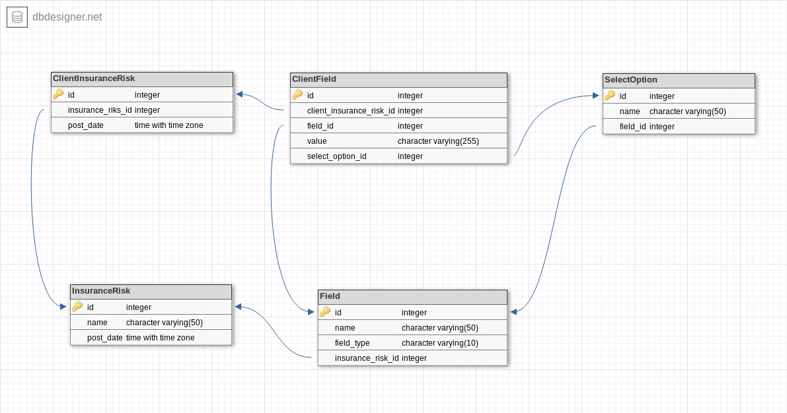

# back-test-brite-core

> An Django project that implements API using the Django REST Framework (DRF). The project implements creating, editing and deleting risk types and policies.

### Prerequisites

Make sure Python 3 is installed:
```console
python -V
```

```output
3.6.7
```

For installing system packages will be used **APT** - a set of tools for managing Debian packages.

Install PIP first:
```console
sudo apt-get install -y python3-pip
```

Install virtualenv using pip3:
```console
sudo pip3 install virtualenv
```

### Installing

Clone the repository:
```console
git clone git@github.com:sinchuk140995/back-test-brite-core.git
```

Go to the project folder and run the command for a virtual environment creating:
```console
virtualenv env
```

Activate the virtualenv:
```console
source env/bin/activate
```

Install the Python dependencies from requirements.txt:
```console
pip install -r requirements.txt
```

Apply the project migrations:
```console
python manage.py migrate
```

Run the Django development server:
```console
python manage.py runserver
```

## Project structure

back-test-brite-core folder structure looks as follows:

    back_test_brite_core/
    ├── back_test_brite_core
    ├── clients
    └── risks

The 3 root level folders separate the **project folder** (back_test_brite_core) and **two app folders** (clients, risks).

The root level folder contains the following files:

    back_test_brite_core/
    ├── manage.py
    ├── Procfile
    ├── requirements.txt
    └── runtime.txt

### back_test_brite_core folder

The inner **back_test_brite_core** folder is the actual Python package for the project.

The content:

    back_test_brite_core/
    ├── __init__.py
    ├── settings.py
    ├── urls.py
    └── wsgi.py

* **__init__.py:** An empty file that tells Python that this folder should be considered a Python package.
* **settings.py:** Settings/configuration for this Django project.
* **urls.py:** The URL declarations for this Django project.
* **wsgi.py:** An entry-point for WSGI-compatible web servers to serve your project.

### clients folder

The app contains models, views, serializers, etc for managing the policies.

App's source code folder layout:

    clients/
    ├── __init__.py
    ├── admin.py
    ├── apps.py
    ├── models.py
    ├── serializers.py
    ├── views.py
    ├── urls.py
    └── tests.py

The models.py file contains next models:
* **ClientInsuranceRisk** - stores clients policies.
* **ClientField** - stores the inputted by clients values of policies:
  * field _value_ stores text and number values.
  * field _select_option_ is a foreign key to the model SelectOption and stores enum option.

### risks folder

The app contains models, views, serializers, etc for managing the risk types.

App's source code folder layout:

    risks/
    ├── __init__.py
    ├── admin.py
    ├── apps.py
    ├── models.py
    ├── serializers.py
    ├── views.py
    ├── urls.py
    └── tests.py

The models.py file contains next models:
* **InsuranceRisk** - describes a general risk type information.
* **Field** - describes a risk type fields.
* **SelectOption** - describes enum fields options.


## Database

### Entity-Attribute-Value (EAV) models

Basic object-relational models in Python Django do not allow users to modify the data model within the application. For example, insurance risk type involve variables such as name, date, etc. The basic model for collecting that data in Django would define every one of those variables in advance in our Python code, from which Django creates an object-relational mapping that amounts to a database table with one column for each variable.

This is a particularly common request for applications involving collection of data in the field. From this demand arises a desire to use Entity-Attribute-Value (EAV) models. The promise of an infinite number of user-defined variables combined in infinite ways tempts users seeking to maximize the value and longevity of an application.

In our case accordingly to EAV models: _entity_ is **risks/InsuranceRisk**, _attribute_ is **risks/Field** and _value_ is **clients/ClientField**.

### Database diagram




## Running the tests

Run the following command to start unit tests:
```console
python manage.py tests
```

* **clients/test.py** contains unit tests for clients app's API views
* **risks/test.py** contains unit tests for risks app's API views


## Deployment

The project contains all necessary files and requirements for deploy to the PasS-platform **Heroku**:

* **Procfile** - a file is used to explicitly declare your application’s process types and entry points.
* **requirements.txt** - a file that contains the required versions of dependent packages.
* **runtime.txt** - a file that declares the exact Python version number.

Web applications relies on several number of parameters to run properly on different environments. To name a few from a Django app settings: database url, password, secret key, debug status, email host, allowed hosts. Most of these parameters are environment-specific. On a development environment you might want to run your application with debug mode on. Also, it’s a clever idea to keep your secret key in a safe place (not in your git repository).

Python Decouple is a great library that helps you strictly separate the settings parameters from your source code.

In the project python-decouple is using to hide some settings variables: _SECRET_KEY_, _DEBUG_, _ALLOWED_HOSTS_, _DB_NAME_, _DB_USER_, _DB_PASSWORD_, _DB_HOST_. So you have to add this keys and their values to the **Heroku Config Vars** or create a file named **.env** in the project root for local development.

Let’s get the deployment started.

First, clone the repository you want to deploy:
```console
git clone git@github.com:sinchuk140995/back-test-brite-core.git
```

Login to Heroku using the heroku toolbelt:
```console
heroku login
```

Inside the project root, create a Heroku App:
```console
heroku create <heroku-app-name>
```

Add a PostgreSQL database to your app:
```console
heroku addons:create heroku-postgresql:hobby-dev
```

Push to deploy:
```console
git push heroku master
```

Migrate the database:
```console
heroku run python manage.py migrate
```

And there you go!

## Built With

* [Django](https://www.djangoproject.com/) - a high-level Python Web framework.
* [Django REST framework](https://www.django-rest-framework.org/) - a powerful and flexible toolkit for building Web APIs.
* [django-cors-headers](https://github.com/ottoyiu/django-cors-headers) - a Django App that adds CORS (Cross-Origin Resource Sharing) headers to responses.
